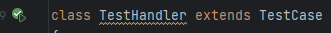

# MAW11_POWERRANGERS
# OOLES

<!-- TOC -->
* [OOLES](#ooles)
* [Tools used](#tools-used)
* [Documentation](#documentation)
* [Code](#code)
* [Lib / framework](#lib--framework)
* [Installation](#installation)
  * [Prerequisites](#prerequisites)
  * [Install](#install)
* [Tests](#tests)
* [Contributors](#contributors)
<!-- TOC -->

# Tools used

- IceScrum
- Notion
- Github
- Discord

# Documentation

**Doc** : Word

**UML :** Astah

# Code

**IDE :** PhpStorm 2023.2

**Package manager :** Composer [2.6.2](https://getcomposer.org/download/)

# Lib / framework

**Frontend :** TailwindCSS

**Tests :** PHPUnit 10.0.19

**Environment :** phpdotenv 5.5.0

**Database :** ext-pdo

# Installation

## Prerequisites

- PHP 8.2.2
- Composer 2.6.2
- MySQL 8.0.34

## Install

- Clone the repository
- Run `composer install`
- Create a `.env` file at the root of the project and fill it with the following information:

```
DATABASE_HOST=localhost
DATABASE_PORT=3306
DATABASE_NAME=ooles
DATABASE_USERNAME=root
DATABASE_PASSWORD=
```

- run DB_create.sql in your database for create tables
- run DB_fill.sql in your database for insert data
- run `php -S localhost:8000 -t public` to start the server

# Tests

- All test files are in the `src/tests` folder
- Press the play button in the test file to run the tests



# Contributors

<div style="display: flex">

<a href="https://github.com/JuilletMikael" style="color: orange"><h1 style="margin: 13px">Mikael</h1></a>
</div>
<br>
<div style="display: flex">

<a href="https://github.com/Cyprien-png" style="color: orange"><h1 style="margin: 13px">Cyprien</h1></a>
</div>
<br>
<div style="display: flex">

<a href="https://github.com/Sebastien-Moraz" style="color: orange"><h1 style="margin: 13px">Sebastien</h1></a>
</div>
